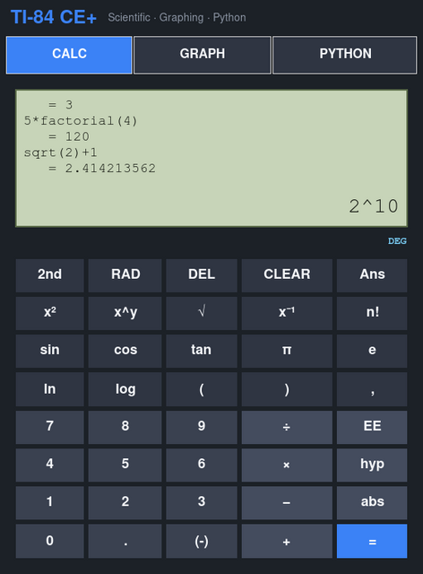
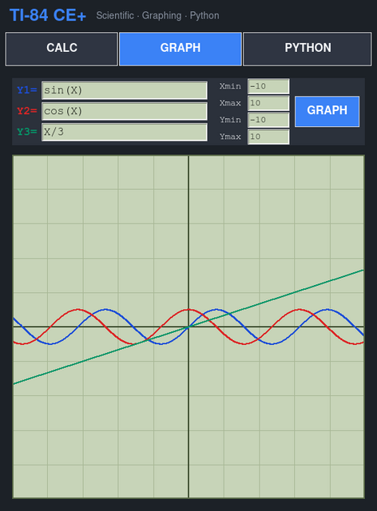
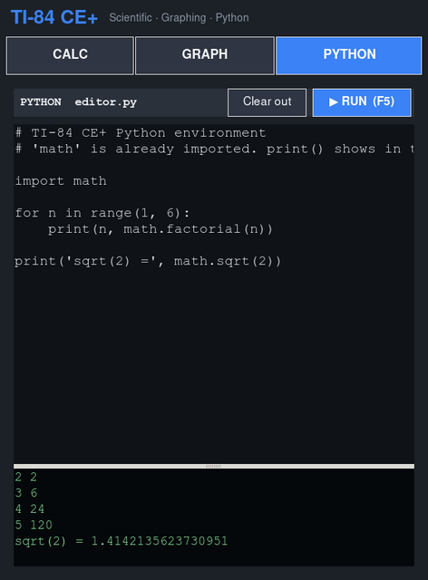
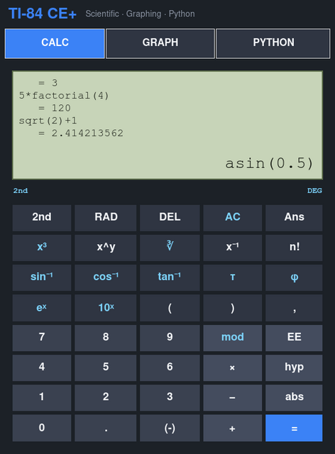

<!-- markdownlint-disable MD007 -- Unordered list indentation -->
<!-- markdownlint-disable MD010 -- No hard tabs -->
<!-- markdownlint-disable MD033 -- No inline html -->
<!-- markdownlint-disable MD055 -- Table pipe style [Expected: leading_and_trailing; Actual: leading_only; Missing trailing pipe] -->
<!-- markdownlint-disable MD041 -- First line in a file should be a top-level heading -->
<div align="center">

[](https://www.python.org/)


</div>
<!--

[](https://www.gnu.org/software/bash/)
[](https://opensource.org/licenses/MIT)


-->

<!-- TOC ignore:true -->
# TI-84 CE+ — Scientific Calculator with Python

A plotting calculator with Python scripting support. Inspired by the TI 84 Plus CE color calculator

Cross-platform (Linux · Windows · macOS) desktop scientific calculator
styled after the **TI-84 Plus CE Python Edition**, with three modes:

| Mode | What it does |
|------|--------------|
| **CALC**   | Full scientific keypad — trig (DEG/RAD), logs, powers/roots, factorial, constants (π, e, τ, φ), `Ans` chaining, a `2nd` modifier, and a scrolling answer history. |
| **GRAPH**  | Plot up to three `Y=` functions of `X` on a Cartesian grid with adjustable window (Xmin/Xmax/Ymin/Ymax). |
| **PYTHON** | A real Python editor + console. Write code, press **▶ RUN** (or `F5` / `Ctrl+Enter`) and see stdout/stderr — just like the calculator's on-device Python app. |

## Why Python + Tkinter?

The calculator's headline feature is *Python programming*, so the host
language **is** the feature — code typed in PYTHON mode runs on the same
interpreter. Tkinter ships with CPython on all three platforms, so the app
has **zero third-party dependencies** and runs out of the box.

## Requirements

- Python **3.8+** with Tkinter (bundled with the standard python.org installers).
  - Debian/Ubuntu: `sudo apt install python3-tk`
  - Fedora: `sudo dnf install python3-tkinter`
  - macOS (Homebrew): `brew install python-tk`
  - Windows: use the official installer with the *tcl/tk* option checked.

## Installation

### Linux

~~~bash
~~~

### Windows

### macOS

## Or clone the repository and run the latest version

```bash

git clone git@github.com:jim-collier/ti84ce-ish.git
ct ti84ce-ish

# Linux / macOS:
python3 ti84ce.py

# Windows
python ti84ce.py

# Or as a module:
python3 -m ti84ce
```

## Run the tests

```bash
python3 -m unittest discover -s tests -v
```

The engine tests run **headless** (no display needed) and cover arithmetic, glyph normalisation (`×÷−√²³⁻¹`), DEG/RAD trig, logs, roots, `Ans` chaining, error handling, and that the calculator parser rejects unsafe input (attribute access, `__import__`, arbitrary calls).

## Safety model

- **CALC** mode never runs raw `eval`. Expressions are parsed to an AST and only whitelisted operators, functions and constants are evaluated, so typing `__import__('os')` is rejected as an error.
- **PYTHON** mode *deliberately* executes arbitrary Python (that is the feature) in a worker thread, with `math` pre-imported and stdout/stderr captured into the console.

## Project layout

```
ti84ce.py            cross-platform launcher (checks for Tkinter)
ti84ce/
  __init__.py        package exports + version
  __main__.py        `python -m ti84ce` entry point
  engine.py          safe AST-based scientific evaluator (GUI-free)
  app.py             Tkinter GUI: CALC / GRAPH / PYTHON modes
tests/
  test_engine.py     headless unit tests for the engine
```

## Build a single-file executable

A helper script bundles everything into one self-contained native binary
(no Python install needed to run it):

```bash
pip install pyinstaller     # one-time
python3 build.py            # Linux / macOS
python  build.py            # Windows
```

Output (PyInstaller builds for whichever OS you run it on):

| OS | Produced file |
|----|---------------|
| Linux   | `dist/ti84ce`     (~12 MB) |
| Windows | `dist/ti84ce.exe` |
| macOS   | `dist/ti84ce` (+ `dist/ti84ce.app`) |

Then just run the file directly — double-click it, or from a terminal:

```bash
./dist/ti84ce        # Linux / macOS
dist\ti84ce.exe      # Windows
```

> A single executable is inherently per-platform: run `build.py` on each OS
> you want a binary for. The build is reproducible from the bundled
> `ti84ce.py` + `ti84ce/` package.

## Keyboard shortcuts

- **CALC**: type directly; `Enter` evaluates.
- **GRAPH**: edit a `Y=` field and press `Enter` to re-plot.
- **PYTHON**: `F5` or `Ctrl+Enter` to run.

## Screenshots

<!-- SCREENSHOTS:START -->
<div align="center">
<a href="assets/screenshots/large/01-calc.png"></a>
<a href="assets/screenshots/large/02-graph.png"></a>
<a href="assets/screenshots/large/03-python.png"></a>
<a href="assets/screenshots/large/04-calc-2nd.png"></a>
</div>
<!-- SCREENSHOTS:END -->

## Copyright and license

> Copyright © 2026 Jim Collier (ID: 1cv◂‡Vᛦ)<br />
> Licensed under the GPLv3 License. See [license.md](license.md).
